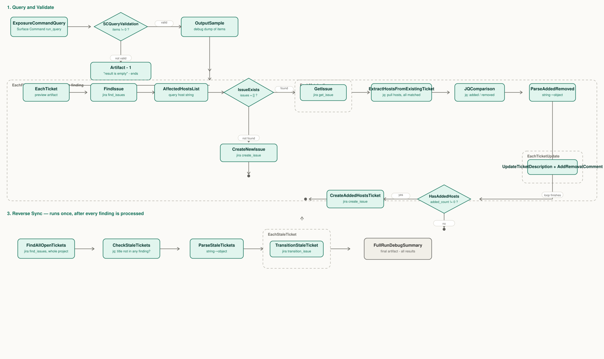

# AWS Inspector to Jira Ticket Sync

An InsightConnect workflow that keeps Jira tickets in sync with AWS Inspector findings pulled from
Rapid7 Surface Command — in both directions. No script steps: every transformation is done with the
`jq` plugin or native InsightConnect steps, so it can be read and modified without writing code.

## Enriched tickets (v2)

The base workflow tracked 6 fields. The enriched build turns each ticket into an actionable,
triage-ready vulnerability record by joining Surface Command's asset/EC2 inventory with **NIST NVD**,
**FIRST EPSS**, and **CISA KEV** — all keyed off the finding's CVE id. Every ticket now carries:

- **Risk / prioritization** — Inspector severity · CVSS v3 score+severity (NVD) · EPSS score+percentile ·
  Exploit Available (Inspector) · **CISA KEV "actively exploited" flag + required action** (only when
  applicable) · CWE weakness · attack vector
- **Description** — the full NIST NVD prose description + an NVD reference link
- **Per affected host** — hostname (ip) with its AWS resource tags: **Owner**, **Repo**, **Environment**
- **Cloud context** — AWS account (name + numeric member-account id, multi-account aware) · OS · region ·
  first observed · last seen · CVE published date
- **Remediation** — Fix Available (Fixed-in-Version deferred; see `docs/WORKFLOW-CHANGES.md`)

Artifacts for the enriched build live alongside this README:

| Path | What it is |
|---|---|
| `queries/inspector-jira-enrichment.cypher` | The Surface Command saved query (paste into your saved query; the workflow references it by `query_id`). **Remove `LIMIT 5` for production.** |
| `workflow/jq/build-ticket.jq` | Per-finding → `{summary, description}` (the enriched ticket body). Locally tested against live query output. |
| `workflow/jq/reconcile.jq` | Replaces `JQComparison`. Host-set math keyed on `host (ip)` only, splice-preserve description rewrite, and the enriched removal comment (lists removed hosts + Owner). |
| `docs/WORKFLOW-CHANGES.md` | Exact node-by-node steps to apply these in the InsightConnect builder, with a confidence/status table. |

**Key data rules** (learned the hard way — see the query header and `docs/WORKFLOW-CHANGES.md`):
- **No real newlines** in query output — they corrupt on the Jira ADF round-trip. The query uses the
  sentinels ` ::HOST:: ` / ` ::TAGS:: ` / ` ::ARN:: `, parsed in jq; final layout newlines are authored
  in jq, not carried through data.
- **NVD/EPSS join on the clean CVE** — `split(a.title, " - ")[0]` (package findings look like
  `CVE-… - <package>`).
- **AWS account id is the LAST 12-digit group** of `acct.`AwsAccount:Arn`` (org-account ARN) — the first
  group is the org management account.
- **CWE lives in `d_weaknesses`**, not `weaknesses` (the latter is empty).
- **Reconcile keys on `host (ip)` only** — a tag change never looks like a remediation.

## What it does

For every finding returned by a Surface Command query, the workflow:

- **Creates a ticket** if none exists yet for that finding.
- **Adds a new ticket** scoped to only the newly-affected hosts, if an existing ticket's host list has
  grown. A new ticket is used deliberately here, not an edit to the old one — editing an existing ticket
  wouldn't trigger "new ticket" alerting in Jira, and would corrupt time-to-remediate metrics that key off
  ticket creation date.
- **Edits the existing ticket down and comments**, if some (but not all) of its hosts have been remediated
  and no longer appear in the query.
- **Closes the ticket automatically**, with an explanatory comment, if a finding disappears from the query
  entirely — a separate pass, run once per workflow execution, checks every open ticket in the project
  against the current query rather than relying on the per-finding loop to catch this case.

## Requirements

- **Rapid7 InsightConnect**, with the following plugins connected:
  - `jira` (Rapid7) — ticket search, create, edit, comment, transition
  - `jq` (Rapid7) — all data transformation and comparison logic
  - `Type Converter` (Rapid7) — converts jq's string output into real objects/arrays for looping
  - `Surface Command` (Rapid7) — the source of finding data
- A **Surface Command saved query** returning findings shaped like:
  ```json
  {
    "title": "string",
    "severity": "string",
    "type": "string",
    "fix_available": "YES/NO",
    "exploit_available": "YES/NO",
    "affected_hosts": "comma-separated host list, e.g. \"host1 (1.2.3.4), host2 (5.6.7.8)\""
  }
  ```
  An example Cypher query for Surface Command's graph, matching this shape:
  ```cypher
  MATCH (a:AwsInspectorExposure)<--(a1:Asset)
  WITH a, collect(DISTINCT a1.hostnames[0] + " (" + a1.ips[0] + ")") AS hosts
  RETURN a.title AS title,
         a.severity AS severity,
         a.type AS type,
         a.fixAvailable AS fix_available,
         a.exploitAvailable AS exploit_available,
         join(hosts, ", ") AS affected_hosts
  ```
  Adjust the node label and property names to match whatever data source you're pulling AWS Inspector
  exposures from. Do **not** add a `LIMIT` clause unless you genuinely want the workflow to only ever
  see a capped number of findings — this is an easy mistake to make while testing and forget to remove.
- A **Jira project** dedicated to this automation, or at least one where it's safe for tickets tagged
  `aws-inspector-auto` to be created, edited, and closed automatically.

## Setup

1. Import `aws-inspector-jira-sync.snpt` into InsightConnect.
2. Reconnect the plugin connections — the imported file references placeholder connection IDs
   (`REPLACE_WITH_YOUR_JIRA_CONNECTION_ID`, `REPLACE_WITH_YOUR_SURFACE_COMMAND_CONNECTION_ID`) that need
   to be pointed at your own configured connections during import.
3. Set the workflow's input parameters:

   | Input | Default | Description |
   |---|---|---|
   | `ProjectID` | `10000` | Your Jira project's numeric ID |
   | `ProjectIDKey` | `PROJ` | Your Jira project's key, used when creating tickets |
   | `CompletedIssueStatus` | `Done` | The status name used both to exclude closed tickets from searches and as the closing transition target — check this matches your project's actual workflow status names |

4. Point `ExposureCommandQuery` at your own saved Surface Command query. Its `query_id` parameter
   currently holds a placeholder (`REPLACE_WITH_YOUR_SURFACE_COMMAND_QUERY_ID`) — find your query's real
   ID by opening it in Surface Command under Workspace, clicking Edit, and reading it out of the URL:
   ```
   https://*.surface.insight.rapid7.com/[some ID number]/ui/queries/edit/[THIS IS THE QUERY ID]
   ```
5. This workflow has no trigger — it's built to be tested manually first. See
   [Scheduling it](#scheduling-it) below for turning it into something that runs on its own.

## How it works

The workflow has three sections, run in order on every execution:

1. **Query and validate** — run the Surface Command query, stop cleanly if it's empty.
2. **Forward sync**, once per finding — find or create the matching ticket(s), and reconcile the exact
   host list.
3. **Reverse sync**, once per run — after every finding has been processed, check every open ticket in
   the project and close any whose finding no longer appears in the query at all.



### Step-by-step reference

**1. Query and validate**

| Node | Type / Plugin | What it does |
|---|---|---|
| `ExposureCommandQuery` | action · Surface Command `run_query` | Runs the saved query, returns `items` (the finding list) |
| `SCQueryValidation` | decision | Checks `items != 0`. Not valid → ends. Valid → continue. |
| `OutputSample` | artifact | Debug dump of the raw query results |

**2. Forward sync** — runs once per finding, inside the `EachFinding` loop

| Node | Type / Plugin | What it does |
|---|---|---|
| `EachTicket` | artifact | Markdown preview of the current finding |
| `FindIssue` | action · jira `find_issues` | JQL search: `project = {ProjectID} AND status != {CompletedIssueStatus} AND summary ~ "Remediation needed for: {title}"`. Can return more than one matching ticket. |
| `AffectedHostsList` | artifact | Holds the current finding's host list as a plain string |
| `IssueExists` | decision | Checks whether `FindIssue` returned anything |

*Branch: no ticket exists yet*

| Node | Type / Plugin | What it does |
|---|---|---|
| `CreateNewIssue` | action · jira `create_issue` | Creates a Task, description wraps the full host list in `[AFFECTED-HOSTS]...[/AFFECTED-HOSTS]` markers, label `aws-inspector-auto` |

*Branch: at least one ticket already exists*

| Node | Type / Plugin | What it does |
|---|---|---|
| `EachMatchedIssue` | loop, over `FindIssue.issues` | For each matched ticket, calls `GetIssue` (jira `get_issue`) to fetch the full ticket body — `find_issues` does not reliably return `description`. Collected via a Loop Output into one array covering every matched ticket. |
| `ExtractHostsFromExistingTicket` | action · jq | Pulls the host list back out from between the markers, for every matched ticket, joined into one combined string |
| `JQComparison` | action · jq | Parses both the query's host list and every matched ticket's host list into arrays, computes `added` and `removed` via jq set subtraction, and computes `ticket_updates` — one entry **per affected ticket**, each with its reduced host list, a pre-formatted new description, and a pre-formatted removal comment |
| `ParseAddedRemoved` | action · Type Converter `string_to_object` | Converts jq's string output into a real object with real array fields |
| `EachTicketUpdate` | loop, over `ticket_updates` | Runs zero times if nothing changed. Per ticket: `UpdateTicketDescription` (jira `edit_issue`) rewrites the description; `AddRemovalComment` (jira `comment_issue`) logs what was removed and why. |
| `HasAddedHosts` | decision | Checks `added_count != 0` |
| `CreateAddedHostsTicket` | action · jira `create_issue` | Only runs if there are genuinely new hosts. Creates a new ticket holding just the newly-added host(s). |

**3. Reverse sync** — runs once, after every finding has been processed

| Node | Type / Plugin | What it does |
|---|---|---|
| `FindAllOpenTickets` | action · jira `find_issues` | JQL: `project = {ProjectID} AND status != {CompletedIssueStatus}`. Scoped to the whole project, not any one finding. |
| `CheckStaleTickets` | action · jq | For every open ticket, checks whether *any* title from the current query appears anywhere in that ticket's summary. If none do, the ticket is "stale." |
| `ParseStaleTickets` | action · Type Converter `string_to_object` | Same pattern as `ParseAddedRemoved` |
| `EachStaleTicket` | loop, over `stale_tickets` | Runs zero times if nothing is stale. Per ticket: `TransitionStaleTicket` (jira `transition_issue`) closes it with a comment. |
| `FullRunDebugSummary` | artifact | Final step. Dumps a summary of the run. |

## Data conventions and key filters

### The `[AFFECTED-HOSTS]` marker convention

Every ticket this workflow creates or edits stores its host list inside the ticket description, wrapped
like this:

```
[AFFECTED-HOSTS]
host1.example.com (1.2.3.4), host2.example.com (5.6.7.8)
[/AFFECTED-HOSTS]
```

This is the only place the workflow looks for host data on an existing ticket. A ticket without these
markers anywhere in its description — a manually-created ticket, for instance — is treated as having
**zero** tracked hosts, not an error. This lets the workflow coexist safely with tickets it didn't create,
at the cost of never being able to reconcile against them.

### Why the extraction filter is defensive

Jira Cloud stores descriptions in a rich-text format (Atlassian Document Format). When a description
round-trips through the API, real newline characters inside it can come back as the literal two-character
text sequence `\n` (backslash followed by the letter n) rather than an actual newline. The extraction
filter strips both real whitespace and this literal artifact — a plain whitespace trim alone will leave
stray characters behind and break exact host-string comparisons.

```jq
def hosts_of(x):
  (x.description // "") as $d
  | if ($d|type)=="string" and ($d|contains("[AFFECTED-HOSTS]"))
    then ($d | split("[AFFECTED-HOSTS]")[1] | split("[/AFFECTED-HOSTS]")[0]
          | gsub("\\\\n"; " ") | gsub("^\\s+|\\s+$"; "")
          | split(",") | map(gsub("^\\s+|\\s+$";"")))
    else []
    end;
```

### Core comparison filter (JQComparison, simplified)

```jq
(.fromASM | split(",") | map(trim)) as $asm
| ([.issues[] | hosts_of(.)] | flatten) as $all_jira_hosts
| ($asm - $all_jira_hosts) as $added
| ($all_jira_hosts - $asm) as $removed
| [.issues[] | hosts_of(.) as $ticket_hosts
    | ($ticket_hosts - $asm) as $removed_here
    | select(($removed_here | length) > 0)
    | { ticket_id: .key, new_hosts: ($ticket_hosts - $removed_here),
        removed_hosts: $removed_here, new_description: ..., removed_comment: ... }
  ] as $ticket_updates
| { added: $added, added_count: ($added|length), removed: $removed, ticket_updates: $ticket_updates }
```

### Why a Type Converter step follows every jq step that outputs an object or array

The `jq` plugin's output field, `json_out`, is always a string — even when the result is shaped like a
JSON object or array. Anything downstream that needs to loop over the result, or read one of its fields
as a real array, needs a `Type Converter` (`string_to_object`) step in between. Feeding jq's output
directly into a delimiter-based splitter (Type Converter's `string_to_list` action) will corrupt
structured data — that action does a literal character split, not JSON parsing, and will cut straight
through commas inside nested objects.

## Known quirks and maintainer notes

- **InsightConnect requires every plain action node to have exactly one incoming and one outgoing edge.**
  Terminal/dead-end steps still need an outgoing edge object in the graph — just one with no `toNodeId`.
  Two branches can never both feed into the same downstream node (no "fan-in") — if two paths need to
  reach equivalent logic, that logic has to be duplicated once per path.

- **A Loop Output errors out entirely if its value expression references a step that didn't execute on a
  given iteration.** It does not default to null. Keep any aggregated Loop Output limited to fields from
  steps that run unconditionally on every iteration.

- **Plugin action identifiers are not always what you'd guess.** Confirmed the hard way, against real
  error messages: `get_issue`'s input field is `id`, not `issue_id`; there is no `delete_issue` action on
  the jira plugin at all (only `Delete User` exists) — closing a ticket has to go through
  `transition_issue`; comment and edit actions are `comment_issue` and `edit_issue`, not `add_comment` /
  `update_issue`. Check the plugin's actual action list rather than guess from naming convention.

- **`find_issues` does not reliably return a ticket's description.** This is why `EachMatchedIssue` exists
  as a separate nested loop calling `get_issue` per matched ticket, rather than reading descriptions
  straight off `FindIssue`'s results.

## Scheduling it

This workflow has no trigger — it was built to be tested manually first. To run it on a schedule:

1. Build a new workflow with a **Timer** trigger (a standard InsightConnect plugin trigger, configurable
   for a schedule on the order of minutes, hours, days, or weeks).
2. Copy this workflow's steps into it (enter Manage Steps mode, select all, copy, paste into the new
   workflow) and wire the Timer's completion edge into `ExposureCommandQuery`.
3. Alternatively, publish this workflow as a **Snippet** and add it as a single Snippet step inside a
   Timer-triggered parent workflow instead — useful if you want to reuse it across more than one trigger
   context. Snippets can't be nested inside other snippets.

InsightConnect doesn't support swapping or adding a trigger onto an existing workflow's trigger slot from
the builder UI directly — both approaches above route around that by building the timer-triggered shell
as a separate workflow.

Before trusting the schedule, trigger one manual test run and confirm it behaves as expected against real
data. If your data source only refreshes periodically (e.g. once a day), there's no benefit to scheduling
the Timer more frequently than that — it'll just mean more redundant "nothing changed" runs.

## Testing before you trust it

A safe way to validate this in a sandbox project before pointing it at anything real:

1. **Clear the project** — close every ticket so you're starting clean.
2. **Initial run** — run the workflow against real (or test) query data. Every finding should take the
   "not found" path and get a fresh ticket.
3. **Re-run immediately** — with the same data, every finding should now match its ticket exactly, and
   nothing should be created, edited, or closed. This is the most important case to get right, since it's
   the one most likely to silently break if a future edit introduces a comparison bug.
4. **Simulate the edge cases** — swap the query step for a fixed, hardcoded set of findings engineered to
   force each scenario in one pass: an unchanged finding, a finding with a genuinely new host, a finding
   missing a previously-tracked host, and a finding removed from the query entirely. Confirm all four
   outcomes match what you'd expect.

## License

MIT — see [LICENSE](LICENSE). Swap this for whatever license fits your organization's needs before
publishing.
